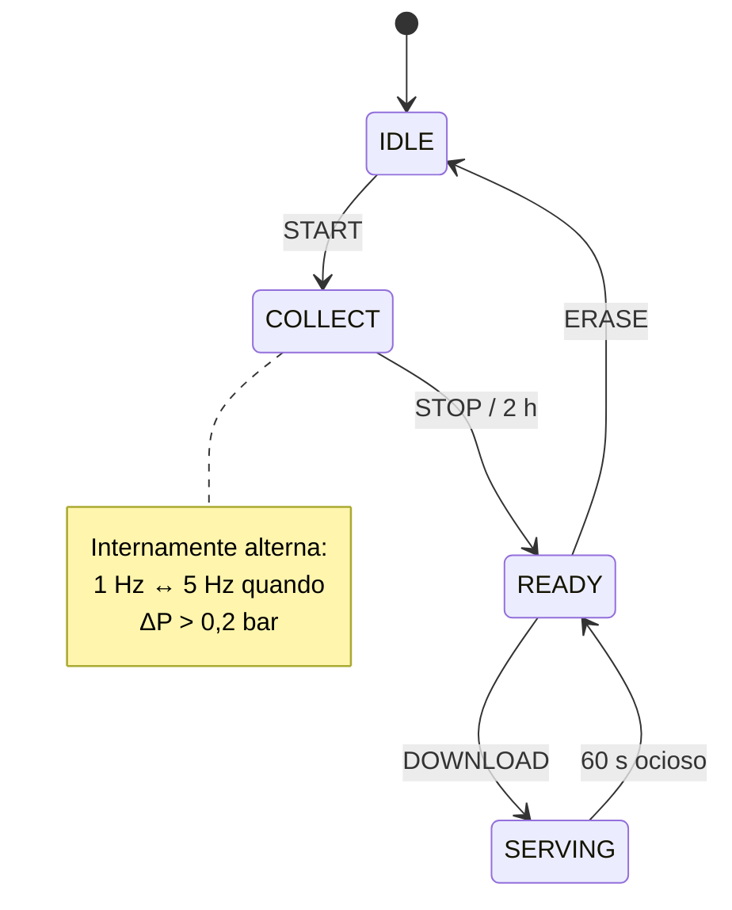
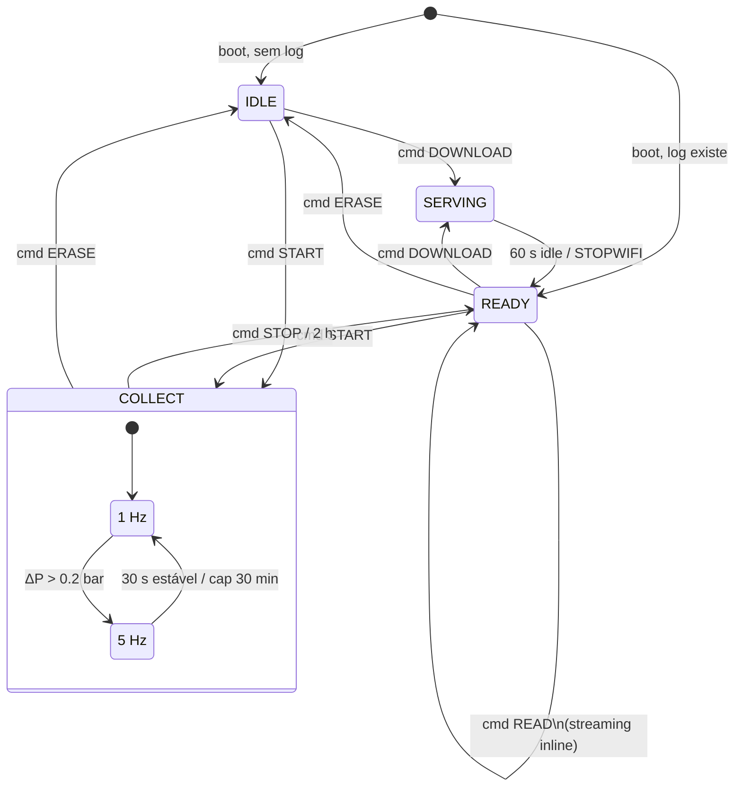

# DEVELOPMENT — Datalogger de Pressão Hidráulica

Documento técnico para quem mantém ou modifica o firmware/PWA. Para o usuário final do equipamento, ver `MANUAL.md`.

---

## 1. Visão arquitetural

```
                ┌──────────────────────────────────┐
                │         ESP32-C3 (XIAO)          │
                │                                  │
   I²C ──────►  │  Driver Keller LD (inline .ino)  │
   (Keller)     │             │                    │
                │             ▼                    │
                │  ┌────────────────────────────┐  │
                │  │  Máquina de estados        │  │
                │  │  IDLE → COLLECT → READY    │  │
                │  │       → SERVING → IDLE     │  │
                │  └─────┬────────┬─────────┬───┘  │
   ADC ───────► │ readBattery() (5s)        │      │
   (BAT/2)      │       │        │          │      │
                │       ▼        ▼          ▼      │
                │   LittleFS   NimBLE     WiFi+    │
                │   /log.csv   GATT       HTTP     │
                └─────────────┬────────────┬───────┘
                              │            │
                            BLE          Wi-Fi AP
                          (sempre)    (sob demanda)
                              │
                              ▼
                ┌──────────────────────────────────┐
                │   PWA (Web Bluetooth)            │
                │   GitHub Pages                   │
                │  - UI de comandos                │
                │  - Streaming do CSV via BLE      │
                │  - Gráfico SVG com zoom          │
                │  - Auto-reconexão                │
                └──────────────────────────────────┘
```

**Decisões de projeto:**

| Decisão | Justificativa |
|---|---|
| BLE peripheral always-on (vs. deep-sleep cycling) | Permite trigger de sessão pelo celular sem botão físico. ~0,5 mA de overhead. |
| BLE **legacy advertising** (não Extended) | Web Bluetooth no Chrome Android só faz scan legacy. Extended Adv ficaria invisível pra PWA. |
| `setCpuFrequencyMhz(80)` (não `esp_pm_configure`) | O core arduino-esp32 precompilado não tem `CONFIG_PM_ENABLE` + tickless idle. `esp_pm_configure` retorna `ESP_ERR_NOT_SUPPORTED`. CPU @ 80 MHz baixa consumo idle de ~17 mA pra ~8-10 mA. |
| Wi-Fi sob demanda apenas | Wi-Fi consome ~80–100 mA; mantê-lo ligado mata a bateria em horas. |
| LittleFS (vs. SPIFFS) | Endurance melhor pra escrita frequente de log; arduino-esp32 v3 tem suporte nativo. |
| Driver Keller inline (vs. biblioteca) | Protocolo é simples (~30 linhas); evita dependência externa e facilita debug. |
| `P_MODE = 0.0f` (gauge, não absolute) | Operador quer 0 = sem pressão aplicada, positivo = pressão acima da atmosfera. Mais intuitivo pra hidráulica de trado. |
| Timestamp relativo (vs. RTC) | RTC externo (DS3231) consome ~3 mA; relativo é "grátis". A PWA mostra a hora absoluta de início via `Date.now()` do celular. |
| Sem senha no AP Wi-Fi | Decisão do usuário. Trocar pra `WiFi.softAP(SSID, PASSWORD)` se quiser proteger. |
| BLE file transfer como caminho primário | Operador não precisa trocar Wi-Fi do celular. Wi-Fi mantido como fallback pra arquivos grandes. |

### 1.1 Máquina de estados — visão geral

Fluxo principal (simplificado). Para todos os estados, sub-estados e transições de exceção, ver **Apêndice A**.



**Como visualizar este diagrama:**
- **GitHub:** renderiza automaticamente quando o `.md` é exibido no site.
- **VS Code:** instale a extensão `Markdown Preview Mermaid Support` (bierner.markdown-mermaid).
- **Online:** copie o bloco e cole em https://mermaid.live.

---

## 2. Hardware

### 2.1 Bill of Materials

| Item | Especificação | Notas |
|---|---|---|
| MCU | Seeed XIAO ESP32-C3 | LED de power **deve ser desabilitado** (ver 2.4) |
| Sensor | Keller PA9LD-50bar | I²C addr `0x40`, lido como gauge (P_MODE=0) |
| Bateria | LiPo 3,7 V 250 mAh | Conectada nos pads **BAT** da XIAO |
| Resistores divisor bateria | 2× 100 kΩ | Mod de leitura de bateria (ver 2.5) |
| Cabo I²C | 4 fios | VCC (3,3 V), GND, SDA, SCL |

### 2.2 Pinagem (XIAO ESP32-C3)

| Função | Pino XIAO | GPIO | Conectar a |
|---|---|---|---|
| SDA (I²C) | D4 | GPIO6 | SDA do sensor Keller |
| SCL (I²C) | D5 | GPIO7 | SCL do sensor Keller |
| BAT_SENSE (ADC) | D0 | GPIO2 | Ponto médio do divisor 100k:100k |
| 3V3 | 3V3 | — | VCC do sensor |
| GND | GND | — | GND do sensor + GND do divisor |

`Wire.begin()` usa SDA/SCL automaticamente quando a board variant **`XIAO_ESP32C3`** está selecionada na Arduino IDE. Não precisa especificar pinos manualmente.

### 2.3 Board variant — atenção

A board selecionada **tem que ser `XIAO_ESP32C3`** (Tools → Board → esp32 → "XIAO_ESP32C3"). **Não usar** `ESP32C3 Dev Module`.

A Dev Module genérica usa SDA=GPIO8 / SCL=GPIO9 como default, fora dos pinos onde o sensor está fisicamente conectado. O firmware compila e sobe sem erro, mas o sensor "não responde" no boot. Sintoma clássico de board errada.

### 2.4 LED-mod obrigatório (XIAO C3)

A XIAO ESP32-C3 tem um LED de power que fica **sempre aceso**. Drena ~2,5 mA contínuos = **60 mAh/dia** = bateria morta em ~4 dias antes de qualquer outra coisa rodar.

**Como remover:**
- Localize o LED de power (próximo ao chip, **não** confundir com o LED de carga laranja perto do USB).
- Use ferro de solda fino com pavio dessoldador, **ou** corte com bisturi a trilha que leva 3,3 V ao LED.
- Confirme com multímetro: corrente em standby (sem firmware rodando) deve cair de ~3 mA para <100 µA.

> ⚠️ Modificação destrutiva. Após o mod, o LED de power nunca mais acende. O LED de carga (laranja, perto do USB) continua funcionando normalmente.

### 2.5 Mod de leitura de bateria (necessário para o indicador)

Como o XIAO ESP32-C3 não tem leitura interna de bateria, é preciso um divisor de tensão simples:

```
BAT+ ─── R1 (100kΩ) ─┬─── R2 (100kΩ) ─── GND
                     │
                     └──── D0 (GPIO2)
```

- R1 e R2 = 100 kΩ cada (qualquer valor entre 47k e 220k serve, desde que iguais)
- Divide a tensão por 2: 4,2 V → 2,1 V no D0; 3,0 V → 1,5 V no D0
- Drain estático: ~21 µA contínuos (negligível)

Calibração observada com 100k×2: erro de 0,17% (4137 mV no multímetro vs. 4130 mV reportado pela ADC). Se o erro for maior, ajustar `BATTERY_DIVIDER` no firmware (atualmente `2.0f`).

---

## 3. Toolchain

### 3.1 Versões mínimas

| Componente | Versão | Onde instalar |
|---|---|---|
| Arduino IDE | 2.x | https://www.arduino.cc/en/software |
| Core arduino-esp32 | **3.x ou maior** | Boards Manager → busca "esp32" by Espressif |
| Biblioteca **NimBLE-Arduino** | **2.x ou maior** | Library Manager → busca "NimBLE-Arduino" by h2zero |

> ⚠️ Versões anteriores **não compilam**: arduino-esp32 v2.x usa Bluedroid no C3 (incompatível com NimBLE), e NimBLE-Arduino v1.x tem APIs diferentes.

### 3.2 Configurações da IDE

Em `Tools`:

| Setting | Valor |
|---|---|
| Board | **XIAO_ESP32C3** (não Dev Module) |
| USB CDC On Boot | **Enabled** (necessário pro Serial via USB nativo) |
| Partition Scheme | **Default 4MB with spiffs** |
| Flash Size | 4MB (32Mb) |
| CPU Frequency | 160 MHz (default — o firmware reduz pra 80 MHz em runtime) |

### 3.3 Sem `build_opt.h`

Versões antigas do firmware exigiam um `build_opt.h` na pasta do sketch com `-DCONFIG_BT_NIMBLE_EXT_ADV=1` para habilitar Extended Advertising. **Esse arquivo não é mais necessário** desde a migração para Legacy Advertising (BLE 4.x), feita para compatibilidade com Web Bluetooth no Chrome Android.

Se encontrar um `build_opt.h` no projeto, pode remover.

---

## 4. Estrutura do código

Tudo do firmware está em `MedidorSinalBLE.ino`, organizado em blocos:

| Bloco | Função |
|---|---|
| Includes + defines | Configurações, UUIDs, constantes de tempo, `BATTERY_*` |
| Globais de estado | Variáveis da máquina de estados, contadores, cache de bateria |
| `struct KellerLD` | Driver inline do sensor (begin, readReg16, readPressure) |
| `readBattery()` | Lê ADC 16x e calcula tensão em mV |
| `publishStatus()` | Notifica o status via BLE (com `r=` e `b=`) |
| `openLogForWrite/append/close` | I/O em LittleFS |
| `startCollection/stopCollection/doSample` | Lógica de coleta + transição 1Hz↔5Hz |
| `startStreaming/streamTick/abortStreaming` | Streaming do log via BLE notify |
| `httpRoot/httpLog/startWifi/stopWifi` | Webserver + AP (fallback de download) |
| `handleCommand` + `CmdCallbacks` | Parsing e execução de comandos BLE |
| `ServerCallbacks` | Auto-restart de advertising no disconnect; tracking de connHandle e MTU |
| `setupBLE()` | Server, service, characteristics, advertising |
| `setup()` + `loop()` | Boot + scheduler principal |

Tudo da PWA está em `docs/`:

| Arquivo | Função |
|---|---|
| `index.html` | App completo: HTML + CSS + JS, ~700 linhas |
| `manifest.json` | Metadados PWA (nome, ícone, cor de tema) |
| `sw.js` | Service worker (cache offline com bypass de HTTP cache) |
| `icon.svg` | Ícone do app (manômetro vetorial) |

---

## 5. Especificação BLE GATT

### 5.1 Identificadores

| Item | UUID |
|---|---|
| Service | `9b78c001-c0de-4d65-a1aa-001122334455` |
| Char `cmd` (Write) | `9b78c002-c0de-4d65-a1aa-001122334455` |
| Char `status` (Read + Notify) | `9b78c003-c0de-4d65-a1aa-001122334455` |
| Char `data` (Notify) | `9b78c004-c0de-4d65-a1aa-001122334455` |
| Device name | `LoggerP_C3` |
| MTU | Negociado até 247 bytes (Android negocia automaticamente) |
| Advertising | **Legacy** (BLE 4.x), 1M PHY, interval 2000 ms |

### 5.2 Comandos aceitos (escrever ASCII em `cmd`)

| Comando | Estados em que é válido | Efeito |
|---|---|---|
| `START` | IDLE, READY | Apaga `/log.csv`, inicia sessão, reseta contadores |
| `STOP` | COLLECT | Fecha arquivo, transiciona pra READY |
| `READ` | READY (com log existente) | Inicia streaming do `/log.csv` via char `data` |
| `DOWNLOAD` | IDLE, READY | Sobe AP Wi-Fi |
| `STOPWIFI` | SERVING | Derruba AP manualmente |
| `ERASE` | qualquer | Apaga `/log.csv`, transiciona pra IDLE |

Comandos inválidos no estado atual são silenciosamente ignorados (apenas logados via Serial).

### 5.3 Formato do `status` (notify)

String ASCII de até 47 bytes. Estrutura: `<estado-base> [<sub-info>...]`. Campos opcionais:

- `r=NNN` — segundos restantes até auto-stop (apenas em COLL)
- `b=NNNN` — tensão da bateria em mV (em qualquer estado, se a leitura for válida)

**Exemplos:**

```
IDLE b=4050
COLL 1Hz n=1234 r=6800 b=4015
COLL 5Hz n=2500 r=6500 b=4010
READY n=14400 b=3920
WIFI 192.168.4.1 b=3895
```

**Quando dispara:**
- Em qualquer mudança de estado.
- A cada amostra durante COLLECT (status com `n` incrementado e `r` decrementado).
- A cada 5 s quando bateria varia ≥ 20 mV.

### 5.4 Protocolo de streaming via `data`

Transferência do `/log.csv` em chunks via notify. Iniciada pelo comando `READ` quando o estado é READY.

**Formato:**

1. **Primeiro notify**: 4 bytes little-endian = tamanho total do arquivo em bytes.
2. **Notifies subsequentes**: chunks crus do CSV, até 200 bytes cada (limitado pelo MTU - 3).
3. **Fim**: cliente sabe que terminou quando `bytes_recebidos == tamanho_total`.

**Performance observada:**
- ~10-30 KB/s efetivo, dependendo da qualidade do link e do MTU negociado.
- Exemplo: 1000 amostras (~15 KB) → ~3 segundos.
- Sessão completa de 2h em 1 Hz (~108 KB) → ~10-20 segundos.

**Aborts automáticos:**
- Se central desconectar durante streaming (ex.: trado descendo), `abortStreaming()` no `onDisconnect` fecha o arquivo e reseta o flag.

### 5.5 Auto-reinício de advertising

NimBLE **não** retoma advertising automaticamente após disconnect. Sem isso, o device fica invisível após a primeira queda de link. `ServerCallbacks::onDisconnect` chama `NimBLEDevice::getAdvertising()->start()` para reiniciar.

Crítico no caso de uso real (trado descendo 50 m fora de alcance, voltando à superfície depois).

---

## 6. Lógica de amostragem adaptativa

```c
// Variáveis-chave
fastMode             // bool: 1Hz ou 5Hz
fastModeEnteredMs    // momento em que entrou em 5Hz
fastModeAccumMs      // tempo cumulativo em 5Hz na sessão (cap 30 min)
lastSpikeMs          // último ΔP > 0,2 bar
DELTA_THRESHOLD_BAR  // 0.2
FAST_DECAY_MS        // 30000 (30 s sem spike → volta a 1Hz)
FAST_MAX_MS          // 1800000 (30 min cap)
```

**Transições:**
- `1Hz → 5Hz`: `ΔP > 0.2 bar` E `fastModeAccumMs < FAST_MAX_MS`
- `5Hz → 1Hz`: `(now - lastSpikeMs) > 30 s` (decay) **OU** cap atingido

---

## 7. Resiliência a queda de energia

- `logFile.flush()` é chamado a cada **16 amostras** (~16 s em 1Hz, ~3 s em 5Hz). Pior caso de perda: as últimas 16 amostras antes da queda.
- No boot, se `/log.csv` existe, o estado vai direto para **READY** — assim o operador consegue baixar o que foi coletado antes da queda.
- LittleFS é robusto a corte de energia: o pior que acontece é o último bloco escrito ficar truncado, não corrompe o filesystem.
- `publishStatus()` é chamado no fim do `setup()` para que clientes que se conectem antes de qualquer mudança de estado recebam o estado real (não "IDLE" hardcoded).

---

## 8. Otimização de energia — status

**Implementado:**
- BLE TX power = 0 dBm (não +9 dBm).
- BLE legacy advertising com interval de 2000 ms (vs. 30 ms default) — economia significativa em idle.
- Wi-Fi só sob demanda (auto-off em 60 s ocioso).
- `setCpuFrequencyMhz(80)` no boot — corta consumo idle de ~17 mA para ~8-10 mA.
- Status BLE só republicado quando bateria varia ≥ 20 mV (evita tráfego desnecessário).

**Não implementado (`esp_pm_configure` com light-sleep):**
- O core arduino-esp32 precompilado retorna `ESP_ERR_NOT_SUPPORTED` (262) porque `CONFIG_PM_ENABLE` + `CONFIG_FREERTOS_USE_TICKLESS_IDLE` não estão habilitados.
- Para light-sleep real (~1-3 mA medio em idle), precisa migrar para PlatformIO com `sdkconfig` custom, OU recompilar arduino-esp32 com PM enabled.
- Atualmente o consumo idle (~8-10 mA) é dominado pela CPU acordada o tempo todo.

**Não implementado (deep-sleep entre sessões):**
- Em IDLE/READY, o consumo é o mesmo de COLLECT sem amostrar (~5-10 mA).
- Adicionar deep-sleep com wake-up por timer ou external reduziria isso significativamente, mas atrapalha o caso "BLE always-on" que é central pro UX.

---

## 9. Build e flash

### 9.1 Compilação limpa

Após qualquer mudança em libs ou versão da NimBLE-Arduino:

1. Feche o IDE.
2. Apague `%LOCALAPPDATA%\Temp\arduino\` (Windows) ou `~/.cache/arduino/` (Linux/macOS).
3. Reabra o IDE e compile.

### 9.2 Upload do firmware

Conecte a XIAO via USB-C. Se a IDE não reconhecer a porta, force o modo bootloader:
1. Pressione e segure o botão **BOOT** da XIAO.
2. Pressione e solte **RESET**.
3. Solte BOOT após ~1 s.

A porta deve aparecer como COMx (Windows) ou /dev/cu.usbmodem* (Mac).

### 9.3 Deploy da PWA

A PWA é servida pelo **GitHub Pages** a partir de `/docs` no repo. Atualizar a PWA é:

1. Editar `docs/index.html`, `docs/sw.js`, etc.
2. **Bumpar** `CACHE` em `sw.js` (ex.: `loggerp-pwa-v11` → `loggerp-pwa-v12`).
3. **Bumpar** o footer no `index.html` (ex.: `v11 · ...`).
4. `git commit && git push origin main`.
5. GitHub Pages publica em ~30-60 s.

O service worker tem `cache: 'reload'` no install para bypassar o HTTP cache do GitHub Pages (que envia `Cache-Control: max-age=600`). Isso garante que atualizações chegam em ~1 minuto, não esperando o cache HTTP expirar.

---

## 10. Troubleshooting de build

| Erro | Causa | Fix |
|---|---|---|
| `'esp_gap_ble_api.h' No such file` | Código tentando usar API Bluedroid | Não usar BLE API antiga; só NimBLE-Arduino |
| `'NimBLEAdvertising' was not declared` | Versão antiga da NimBLE-Arduino | Atualizar pra v2.x |
| `text section exceeds available space` | App partition cheio | Trocar pra "Huge APP (3MB No OTA/1MB SPIFFS)" |
| `LittleFS.h: No such file` | Core esp32 desatualizado | Atualizar arduino-esp32 para v3.x |
| `analogReadMilliVolts` undefined | Core esp32 v2.x | Atualizar para v3.x |

---

## 11. Troubleshooting runtime

| Sintoma | Diagnóstico | Ação |
|---|---|---|
| Boot mostra `[AVISO] Sensor Keller nao respondeu` | I²C falhou — provável **board variant errada** | Confirmar board é `XIAO_ESP32C3`, não `ESP32C3 Dev Module`. Verificar wiring SDA=D4, SCL=D5 |
| Boot mostra `[BAT] 0 mV` ou tensão muito baixa | Divisor de bateria não conectado, ou GPIO errado | Conferir solda no D0 (GPIO2) e R1/R2 |
| Boot mostra `[ERRO] LittleFS nao iniciou` | Partição corrompida ou inexistente | `LittleFS.begin(true)` confirma format-on-fail; se persistir, refazer partição |
| BLE conecta mas escrita em `cmd` é ignorada | UUID errado, formato errado | Garantir escrita em formato **TEXT (UTF-8)**, não HEX |
| PWA não acha o `LoggerP_C3` mas nRF Connect acha | Firmware está em Extended Advertising em vez de Legacy | Confirmar `setupBLE()` usa `NimBLEAdvertising`, não `NimBLEExtAdvertising` |
| AP Wi-Fi sobe mas celular não conecta | Em alguns Androids, redes 100% abertas exigem confirmação manual | Adicionar rede manualmente |
| Pressão lida está sempre próxima de zero (mas com pequenas variações) | Comportamento esperado em modo gauge (`P_MODE=0`) | Em atmosfera, ~0 ± 0,1 bar é normal |
| Após disconnect, dispositivo "some" e exige reset | `ServerCallbacks::onDisconnect` não está reiniciando adv | Confirmar que `pServer->setCallbacks(new ServerCallbacks())` está em `setupBLE()` |
| PWA mostra valores antigos depois de update | Service worker servindo cache obsoleto | Esperar ~1 min após push (SW updates automaticamente). Se persistir, Configurações Android → Apps → "Logger Pressao SCPT" → Limpar dados |

---

## 12. Estendendo o firmware/PWA

### Adicionar comando novo

1. Em `handleCommand()`, adicionar um `else if (cmd == "MEU_CMD")`.
2. Adicionar botão na PWA (`docs/index.html`) com `onclick = () => sendCmd('MEU_CMD')`.
3. Documentar em `MANUAL.md` (seção 12) e neste arquivo (5.2).

### Mudar formato de log

Editar `appendLog()` em `MedidorSinalBLE.ino`. Se mudar separador ou colunas:
- Atualizar a seção 8 do `MANUAL.md`.
- Atualizar o parser `parseCsvBytes()` na PWA.
- Bumpar versão da PWA.

### Adicionar segundo sensor (ex.: temperatura)

O Keller PA9LD já lê temperatura junto com pressão (`readPressure()` ignora os bytes T_hi/T_lo). Para gravar:

- `KellerLD::readPressure()` — retornar também temperatura.
- `appendLog()` — gravar 3ª coluna.
- Header CSV: `ms;bar;degC`.
- PWA: parser e segunda linha no gráfico.

### Habilitar light-sleep automático

Requer migração do toolchain:

**Opção A:** PlatformIO com `sdkconfig` custom habilitando `CONFIG_PM_ENABLE=y` e `CONFIG_FREERTOS_USE_TICKLESS_IDLE=y`.

**Opção B:** Recompilar arduino-esp32 a partir do source com essas flags.

Após habilitar:

```cpp
#include <esp_pm.h>

esp_pm_config_t pm = {
    .max_freq_mhz = 160,
    .min_freq_mhz = 10,
    .light_sleep_enable = true
};
esp_pm_configure(&pm);
```

> ⚠️ Pode causar artefatos no I²C ou BLE se o timing ficar fora de margem. Validar em hardware.

---

## 13. PWA — arquitetura

### 13.1 Fluxo de conexão

1. **`requestDevice`** com filtro por nome (`LoggerP_C3`) e `optionalServices` listando o UUID do serviço.
2. **`gatt.connect()`** abre conexão GATT.
3. **`bindCharacteristics()`** localiza CMD, STATUS, DATA. Subscribe nas duas notify.
4. **Wake Lock API** mantém a tela acesa para evitar que Chrome descarte o `BluetoothDevice`.

### 13.2 Auto-reconexão

`device.addEventListener('gattserverdisconnected', onDisconnected)` dispara `startReconnectLoop()`:

- `setInterval` a cada 4 s tentando `device.gatt.connect()`.
- Reusa o mesmo `BluetoothDevice` (não exige nova interação do usuário).
- Card vira laranja pulsante "Reconectando".
- Botão Conectar vira "Reconectando... (toque pra cancelar)".

### 13.3 Streaming do CSV

`startBleDownload()`:

1. Reset estado, mostra barra de progresso.
2. Envia `READ`.
3. Watchdog de 5 s pra primeiro chunk (header de 4 bytes).
4. `onDataChunk` parser:
   - Primeiro chunk → `streamTotal = mv` (4 bytes LE).
   - Demais → `streamChunks.push(chunk)`, atualiza progresso.
   - Quando `streamReceived >= streamTotal` → `finishStream()`.
5. `finishStream()` monta `Blob` + `File`, renderiza gráfico, chama `navigator.share({files})`.
6. Watchdog de 15 s entre chunks. Se travar, aborta.

### 13.4 Gráfico SVG

Renderização inline em SVG (sem biblioteca externa). Componentes:

- **`parseCsvBytes(bytes)`**: parser do CSV → `{points, ma, pMax, pMaxIdx, tMin, tMax}`.
- **`computeMA(points, window)`**: média móvel com janela crescente nas primeiras 49 amostras.
- **`drawChart()`**: SVG com grid, axes, linha azul, linha laranja (MA), bolinha vermelha do pico, labels.

### 13.5 Pinch zoom

**Pointer Events com `setPointerCapture`** (não Touch Events).

Touch Events são instáveis no Chrome do Android: durante uma pinça, apenas o primeiro `touchmove` dispara, depois Chrome cancela os eventos pra entregar o gesto pra "pinch-to-zoom da página" — mesmo com `touch-action: none` no elemento. Pointer Events com `setPointerCapture` ficam "presos" ao elemento e o browser não consegue redirecionar.

Tracking dos dedos via `Map<pointerId, {x, y}>` reproduz a ergonomia de `e.touches`.

### 13.6 Service worker

`docs/sw.js`:

- Cache versionado (`loggerp-pwa-vN`).
- `install`: `cache.addAll(ASSETS)` com `cache: 'reload'` para bypassar HTTP cache.
- `activate`: limpa caches antigos (que não batem com `CACHE`).
- `fetch`: cache-first para mesmo origin, network direto para outros origins (incluindo `http://192.168.4.1`).

**Bumpar versão a cada update** é obrigatório para forçar reinstalação do SW.

---

## 14. Referências

- **Protocolo Keller 4LD/9LD:** http://www.keller-druck2.ch/swupdate/InstallerD-LineAddressManager/manual/Communication_Protocol_4LD-9LD_en.pdf
- **Biblioteca de referência (não usada):** https://github.com/bluerobotics/BlueRobotics_KellerLD_Library
- **NimBLE-Arduino:** https://github.com/h2zero/NimBLE-Arduino
- **XIAO ESP32-C3 datasheet:** https://wiki.seeedstudio.com/XIAO_ESP32C3_Getting_Started/
- **Web Bluetooth API:** https://developer.mozilla.org/en-US/docs/Web/API/Web_Bluetooth_API
- **Pointer Events spec:** https://www.w3.org/TR/pointerevents/

---

## Apêndice A — Diagrama de estados completo

Versão de referência com **todas as transições** que existem no código.



**Diferenças vs. o diagrama simplificado da seção 1.1:**

| Detalhe extra aqui | Por que importa |
|---|---|
| Boot pode entrar direto em READY | Quando há log de sessão anterior preservado |
| `IDLE → SERVING` direto | Permite baixar logs antigos sem nova coleta |
| `COLLECT → IDLE` por ERASE | Cancelar e apagar uma sessão em andamento |
| `READY → READY` por READ | Streaming via BLE não muda estado |
| Sub-estados Hz1/Hz5 | Mostra que o switch é interno a COLLECT |

---

*Última revisão: 2026-05-10*
