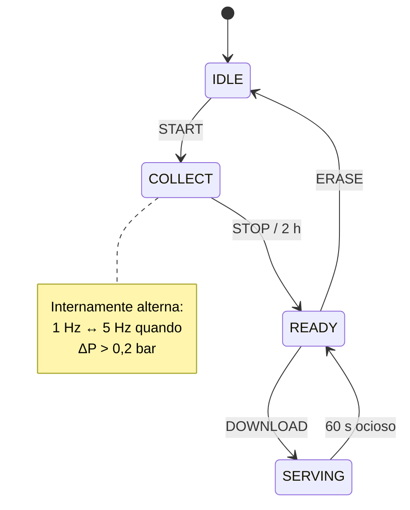
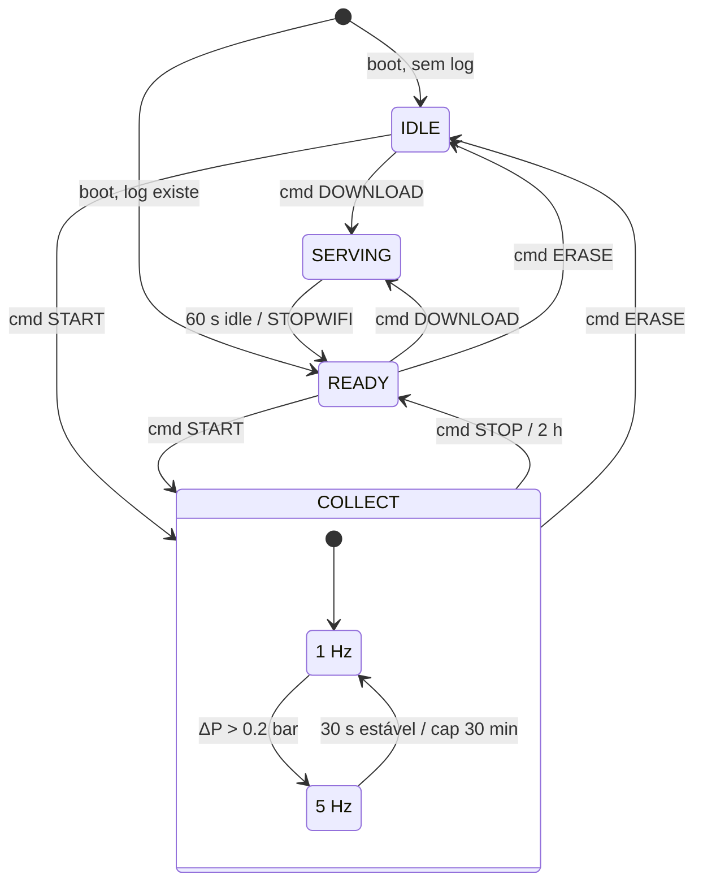

# DEVELOPMENT — Datalogger de Pressão Hidráulica

Documento técnico para quem mantém ou modifica o firmware. Para o usuário final do equipamento, ver `MANUAL.md`.

---

## 1. Visão arquitetural

```
                ┌──────────────────────────────────┐
                │         ESP32-C3 (XIAO)          │
                │                                  │
   I²C ──────►  │  Driver Keller LD (inline .ino)  │
   (Keller)     │             │                    │
                │             ▼                    │
                │  ┌────────────────────────────┐  │
                │  │  Máquina de estados        │  │
                │  │  IDLE → COLLECT → READY    │  │
                │  │       → SERVING → IDLE     │  │
                │  └─────┬─────────┬──────────┬─┘  │
                │        │         │          │    │
                │     LittleFS  NimBLE     WiFi+   │
                │     /log.csv  GATT       HTTP    │
                └────────┴─────────┴──────────┴────┘
                                BLE          Wi-Fi AP
                              (sempre)    (sob demanda)
```

**Decisões de projeto:**

| Decisão | Justificativa |
|---|---|
| BLE peripheral always-on (vs. deep-sleep cycling) | Permite trigger de sessão pelo celular sem botão físico. ~0,5 mA de overhead. |
| Wi-Fi sob demanda apenas | Wi-Fi consome ~80–100 mA; mantê-lo ligado mata a bateria em horas. |
| LittleFS (vs. SPIFFS) | Endurance melhor pra escrita frequente de log; arduino-esp32 v3 tem suporte nativo. |
| Driver Keller inline (vs. biblioteca) | Protocolo é simples (~30 linhas); evita dependência externa e facilita debug. |
| Timestamp relativo (vs. RTC) | RTC externo (DS3231) consome ~3 mA; relativo é "grátis" e suficiente para análise post-hoc. |
| Sem senha no AP Wi-Fi | Decisão do usuário. Trocar pra `WiFi.softAP(SSID, PASSWORD)` se quiser proteger. |

### 1.1 Máquina de estados — visão geral

Fluxo principal (simplificado). Para todos os estados, sub-estados e transições de exceção, ver **Apêndice A** ao final do documento.



**Como visualizar este diagrama:**
- **GitHub:** renderiza automaticamente quando o `.md` é exibido no site.
- **VS Code:** instale a extensão `Markdown Preview Mermaid Support` (bierner.markdown-mermaid). Ctrl+Shift+V abre o preview.
- **Online:** copie o bloco entre os ` ```mermaid ` e cole em https://mermaid.live para visualizar e exportar como PNG/SVG.

---

## 2. Hardware

### 2.1 Bill of Materials

| Item | Especificação | Notas |
|---|---|---|
| MCU | Seeed XIAO ESP32-C3 | LED de power **deve ser desabilitado** (ver 2.3) |
| Sensor | Keller PA9LD-50bar | I²C addr `0x40`, modo PA (sealed gauge) |
| Bateria | LiPo 3,7 V 250 mAh | Conectada nos pads **BAT** da XIAO |
| Cabo I²C | 4 fios | VCC (3,3 V), GND, SDA, SCL |

### 2.2 Pinagem I²C (XIAO ESP32-C3)

| Função | Pino XIAO | GPIO | Conectar a |
|---|---|---|---|
| SDA | D4 | GPIO6 | Pino SDA do sensor Keller |
| SCL | D5 | GPIO7 | Pino SCL do sensor Keller |
| 3V3 | 3V3 | — | VCC do sensor |
| GND | GND | — | GND do sensor |

`Wire.begin()` usa esses pinos por padrão na XIAO C3 — não precisa especificar pinos manualmente.

### 2.3 LED-mod obrigatório (XIAO C3)

A XIAO ESP32-C3 tem um LED de power que fica **sempre aceso**. Drena ~2,5 mA contínuos = **60 mAh/dia** = bateria morta em ~4 dias antes de qualquer outra coisa rodar.

**Como remover:**
- Localize o LED de power (próximo ao chip, não confundir com o LED de carga laranja perto do USB).
- Use um ferro de solda fino com pavio dessoldador, **ou** corte com bisturi a trilha que leva 3,3 V ao LED.
- Confirme com multímetro: corrente em standby (sem firmware rodando) deve cair de ~3 mA para <100 µA.

> ⚠️ Modificação destrutiva. Após o mod, o LED de power nunca mais acende. O LED de carga (laranja, perto do USB) continua funcionando normalmente.

---

## 3. Toolchain

### 3.1 Versões mínimas

| Componente | Versão | Onde instalar |
|---|---|---|
| Arduino IDE | 2.x | https://www.arduino.cc/en/software |
| Core arduino-esp32 | **3.x ou maior** | Boards Manager → busca "esp32" by Espressif |
| Biblioteca **NimBLE-Arduino** | **2.x ou maior** | Library Manager → busca "NimBLE-Arduino" by h2zero |

> ⚠️ Versões anteriores **não compilam**: arduino-esp32 v2.x usa Bluedroid no C3 (incompatível com nosso código NimBLE), e NimBLE-Arduino v1.x não tem `NimBLEExtAdvertisement`.

### 3.2 Configurações da IDE

Em `Tools`:

| Setting | Valor |
|---|---|
| Board | **XIAO_ESP32C3** |
| USB CDC On Boot | **Enabled** (necessário pro Serial via USB nativo) |
| Partition Scheme | **Default 4MB with spiffs** |
| Flash Size | 4MB (32Mb) |
| CPU Frequency | 160 MHz (default) |

> 📌 Atualmente o sketch ocupa ~98% do app partition no esquema `Default 4MB with spiffs` (~1,28 MB). Se for adicionar features, considere mudar pra `Huge APP (3MB No OTA/1MB SPIFFS)` que dá 3 MB de app e ainda preserva 1 MB pro LittleFS.

### 3.3 Arquivo `build_opt.h`

A pasta do sketch contém `build_opt.h` com:

```
-DCONFIG_BT_NIMBLE_EXT_ADV=1
```

Esse flag é **obrigatório** — sem ele, `NimBLEExtAdvertisement` não compila e a build falha com `was not declared in this scope`.

O `build_opt.h` é o mecanismo do arduino-esp32 v3.x para injetar flags de compilação em todos os arquivos do projeto, **inclusive bibliotecas**. Isso torna o projeto portável: qualquer máquina com a NimBLE-Arduino instalada com defaults vai compilar sem precisar editar `nimconfig.h` manualmente.

**Não remova esse arquivo.** Se ele for perdido, recrie com a linha acima.

---

## 4. Estrutura do código

Tudo está em `MedidorSinalBLE.ino`, organizado em blocos:

| Bloco | Linhas (aprox.) | Função |
|---|---|---|
| Includes + defines | 1–40 | Configurações e UUIDs |
| Globais de estado | 42–60 | Variáveis da máquina de estados, contadores |
| `struct KellerLD` | 62–115 | Driver inline do sensor (begin, readReg16, readPressure) |
| `publishStatus()` | 118–135 | Notifica o status atual via BLE |
| `openLogForWrite/append/close` | 137–165 | I/O em LittleFS |
| `startCollection/stopCollection/doSample` | 167–230 | Lógica de coleta + transição 1Hz↔5Hz |
| `httpRoot/httpLog/startWifi/stopWifi` | 232–270 | Webserver + AP |
| `handleCommand` + `CmdCallbacks` | 272–295 | Parsing e execução de comandos BLE |
| `setupBLE()` | 297–325 | Server, service, characteristics, advertising |
| `setup()` + `loop()` | 327–fim | Boot + scheduler principal |

---

## 5. Especificação BLE GATT

### 5.1 Identificadores

| Item | UUID |
|---|---|
| Service | `9b78c001-c0de-4d65-a1aa-001122334455` |
| Característica `cmd` (Write) | `9b78c002-c0de-4d65-a1aa-001122334455` |
| Característica `status` (Read + Notify) | `9b78c003-c0de-4d65-a1aa-001122334455` |
| Device name | `LoggerP_C3` |

### 5.2 Comandos aceitos (escrever ASCII em `cmd`)

| Comando | Estados em que é válido | Efeito |
|---|---|---|
| `START` | IDLE, READY | Apaga `/log.csv`, inicia sessão, reseta contadores |
| `STOP` | COLLECT | Fecha arquivo, transiciona pra READY |
| `DOWNLOAD` | IDLE, READY | Sobe AP Wi-Fi |
| `STOPWIFI` | SERVING | Derruba AP manualmente |
| `ERASE` | qualquer | Apaga `/log.csv`, transiciona pra IDLE |

Comandos inválidos no estado atual são silenciosamente ignorados (apenas logados via Serial).

### 5.3 Formato do status notify

String ASCII de até ~24 bytes. Padrão: `<estado> [<sub-info>]`. Exemplos:

```
IDLE
COLL 1Hz n=1234
COLL 5Hz n=2500
READY n=14400
WIFI 192.168.4.1
```

Notificações disparam: ao mudar de estado, e a cada 30 amostras durante COLLECT.

---

## 6. Lógica de amostragem adaptativa

```c
// Variáveis-chave
fastMode             // bool: 1Hz ou 5Hz
fastModeEnteredMs    // momento em que entrou em 5Hz
fastModeAccumMs      // tempo cumulativo em 5Hz na sessão (cap 30 min)
lastSpikeMs          // último ΔP > 0,2 bar
DELTA_THRESHOLD_BAR  // 0.2
FAST_DECAY_MS        // 30000 (30 s sem spike → volta a 1Hz)
FAST_MAX_MS          // 1800000 (30 min cap)
```

**Transições:**
- `1Hz → 5Hz`: `ΔP > 0.2 bar` E `fastModeAccumMs < FAST_MAX_MS`
- `5Hz → 1Hz`: `(now - lastSpikeMs) > 30 s` (decay) **OU** cap atingido

**Caso de borda conhecido:** se a coleta chegar ao cap de 30 min e o operador esperar a coleta acabar, ela continua em 1 Hz mesmo com pressão variando. Isso é intencional (proteção da bateria), mas se for problema, ajustar `FAST_MAX_MS`.

---

## 7. Resiliência a queda de energia

- `logFile.flush()` é chamado a cada **16 amostras** (~16 s em 1Hz, ~3 s em 5Hz). Pior caso de perda: as últimas 16 amostras antes da queda.
- No boot, se `/log.csv` existe, o estado vai direto para **READY** — assim o operador consegue baixar o que foi coletado antes da queda.
- LittleFS é robusto a corte de energia: o pior que acontece é o último bloco escrito ficar truncado, não corrompe o filesystem.

---

## 8. Otimização de energia — status

**Implementado:**
- BLE TX power = 0 dBm (não +9 dBm).
- Wi-Fi só sob demanda (auto-off em 60 s ocioso).
- `delay(10)` no loop yields pro scheduler do FreeRTOS, permitindo NimBLE gerenciar light-sleep do rádio.

**Não implementado (pendências):**
- `esp_pm_configure()` com `light_sleep_enable=true`. Sem isso, a CPU fica acordada o tempo todo, consumindo ~10 mA em vez de <1 mA.
- Deep sleep entre sessões. Hoje, em IDLE, o consumo é o mesmo de COLLECT sem amostrar (~5–10 mA). Adicionar deep sleep com wake-up por timer ou external reduziria isso significativamente.
- Power-gate do sensor com MOSFET. O Keller PA9LD-50bar é low-power, então provavelmente não vale a complexidade — mas confirmar com medição.

**Recomendado antes de otimizar mais:**
1. Soldar a bateria, fazer o LED-mod, deixar o equipamento rodando sem coleta.
2. Medir corrente média com multímetro em série (idealmente um µCurrent ou similar pra distinguir picos vs. média).
3. Se a autonomia real estiver abaixo de ~5 dias, aí sim mexer em PM/deep-sleep.

---

## 9. Build e flash

### 9.1 Compilação limpa

Após qualquer mudança em `build_opt.h` ou troca de versão da NimBLE-Arduino:

1. Feche o IDE.
2. Apague `%LOCALAPPDATA%\Temp\arduino\` (Windows) ou `~/.cache/arduino/` (Linux/macOS).
3. Reabra o IDE e compile.

### 9.2 Upload

Conecte a XIAO via USB-C. Se a IDE não reconhecer a porta, force o modo bootloader:
1. Pressione e segure o botão **BOOT** da XIAO.
2. Pressione e solte **RESET**.
3. Solte BOOT após ~1 s.

A porta deve aparecer como COMx (Windows) ou /dev/cu.usbmodem* (Mac).

---

## 10. Troubleshooting de build

| Erro | Causa | Fix |
|---|---|---|
| `'esp_gap_ble_api.h' No such file` | Código tentando usar API Bluedroid | Não usar BLE API antiga; só NimBLE-Arduino. Esse erro indica que voltou pra um sketch antigo. |
| `'NimBLEExtAdvertisement' was not declared` | Flag `CONFIG_BT_NIMBLE_EXT_ADV` desligado | Confirmar que `build_opt.h` existe na pasta do sketch e contém `-DCONFIG_BT_NIMBLE_EXT_ADV=1`. Limpar cache e recompilar. |
| `text section exceeds available space` | App partition cheio | Trocar pra "Huge APP (3MB No OTA/1MB SPIFFS)" |
| `LittleFS.h: No such file` | Core esp32 desatualizado | Atualizar arduino-esp32 para v3.x |
| Linha de erro vermelha mas só warning | Falso positivo do IDE | Procurar a linha "Sketch uses … bytes" — se aparecer, compilou |

---

## 11. Troubleshooting runtime

| Sintoma | Diagnóstico | Ação |
|---|---|---|
| Boot mostra `[AVISO] Sensor Keller nao respondeu` | I²C falhou | Verificar wiring, pull-ups (10kΩ típicos), endereço (sensor pode estar configurado com addr ≠ 0x40 — ler datasheet específica) |
| Boot mostra `[ERRO] LittleFS nao iniciou` | Partição corrompida ou inexistente | Mudar `LittleFS.begin(true)` confirma format-on-fail; se persistir, refazer partição via `Tools → ESP32 Sketch Data Upload` |
| BLE conecta mas escrita em `cmd` é ignorada | UUID errado, formato errado | Garantir escrita em formato **TEXT (UTF-8)**, não HEX |
| Status nunca atualiza após connect | Notificações não habilitadas | No nRF Connect, ativar "subscribe" no descriptor da char `status` |
| AP Wi-Fi sobe mas celular não conecta | Em alguns Androids, redes 100% abertas exigem confirmação manual | Adicionar rede manualmente no celular |
| Pressão lida está sempre ~1.0 bar | Possível sensor desconectado retornando lixo | Confirmar via Serial: `Pmin/Pmax` lidos do sensor devem fazer sentido (0 e 50 para o PA9LD-50bar) |

---

## 12. Estendendo o firmware

### Adicionar comando novo

1. Em `handleCommand()`, adicionar um `else if (cmd == "MEU_CMD")`.
2. Documentar em `MANUAL.md` (seção 5) e neste arquivo (5.2).

### Mudar formato de log

Editar `appendLog()` em `MedidorSinalBLE.ino`. Se mudar separador ou colunas, atualizar a seção 7 do `MANUAL.md`.

### Adicionar segundo sensor

Cada amostra hoje grava só pressão. Para adicionar temperatura (já lida pelo Keller mas descartada), modificar:

- `KellerLD::readPressure()` — retornar também temperatura
- `appendLog()` — gravar 3ª coluna
- Header CSV: `ms;bar;degC`

### Habilitar light-sleep automático

Adicionar no `setup()`:

```cpp
#include <esp_pm.h>

esp_pm_config_t pm = {
    .max_freq_mhz = 80,
    .min_freq_mhz = 10,
    .light_sleep_enable = true
};
esp_pm_configure(&pm);
```

> ⚠️ Pode causar artefatos no I²C ou BLE se o timing ficar fora de margem. Validar com osciloscópio antes de declarar funcional.

---

## 13. Referências

- **Protocolo Keller 4LD/9LD:** http://www.keller-druck2.ch/swupdate/InstallerD-LineAddressManager/manual/Communication_Protocol_4LD-9LD_en.pdf
- **Biblioteca de referência:** https://github.com/bluerobotics/BlueRobotics_KellerLD_Library (não usada, mas validou nosso protocolo)
- **NimBLE-Arduino:** https://github.com/h2zero/NimBLE-Arduino
- **arduino-esp32 build_opt.h:** https://docs.espressif.com/projects/arduino-esp32/en/latest/guides/core_build_options.html
- **XIAO ESP32-C3 datasheet:** https://wiki.seeedstudio.com/XIAO_ESP32C3_Getting_Started/

---

## Apêndice A — Diagrama de estados completo

Versão de referência com **todas as transições e sub-estados** que existem no código. Use este diagrama quando precisar entender comportamentos de borda (ERASE durante coleta, boot com log preexistente, alternância 1 Hz ↔ 5 Hz dentro de COLLECT etc.).



**Diferenças vs. o diagrama simplificado da seção 1.1:**

| Detalhe extra aqui | Por que importa |
|---|---|
| Boot pode entrar direto em READY | Quando há log de sessão anterior preservado (queda de energia), o equipamento "lembra" e oferece download |
| `IDLE → SERVING` direto | Permite baixar logs antigos sem precisar passar por uma nova coleta |
| `COLLECT → IDLE` por ERASE | Caso de exceção: cancelar e apagar uma sessão em andamento |
| Sub-estados Hz1/Hz5 explícitos | Mostra que o switch é interno a COLLECT, não muda o estado de alto nível visto pelo BLE |

---

*Última revisão: 2026-05-06*
